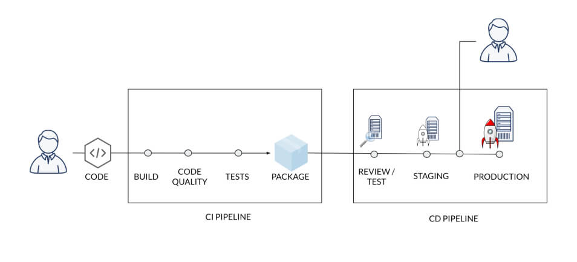

## <mark>What is a good engineer? <br/>How good is your team? <br/>How does the environment affect the team? </mark>

## Collaborating and Teamwork:

I believe the environment can affect the development and delivery process.
And code env can effect on efficiency. 

## Why is CI/CD Like the Culture of Your Code?

CI/CD (Continuous Integration/Continuous Deployment) is often compared to the culture of your code because it represents a set of practices and values that shape how code is developed, tested, and deployed.<br/> Just as culture influences behavior and attitudes, CI/CD influences the workflow and quality of software development. It encourages frequent integration, automated testing, and consistent deployment, fostering a culture of collaboration, efficiency, and quality.



## The Journey of CI/CD:
*From Development to User*

1) **Write the Code:**
   - Developers write new code or modify existing code to add features, fix bugs, or improve performance.

2) **Test It:**
   - **Linting:** Automated tools check the code for syntax errors and adherence to coding standards.
   - **Unit Tests:** Automated tests verify the functionality of individual components or units of the code.
   - **Code Review:** Peers review the code for quality, readability, and adherence to best practices.

3) **Build:**
   - The code is compiled or packaged into a build that can be deployed to a testing or production environment.

4) **Review:**
   - **End-to-End (E2E) Tests:** Automated tests simulate user scenarios to ensure the application works as expected from start to finish.

5) **Deploy:**
   - The build is deployed to a production environment, making the new features or fixes available to users.

6) **Manual Test:**
   - Manual testing may be performed as a final check to ensure that the application behaves as expected in the live environment.


# CI Pipeline contains: 
## <mark>1. Stages</mark>

```
Source Stage: Compilation, Dependency Management
Test Stage: Unit Testing, Integration Testing, Static Code Analysis
Quality Assurance Stage: Code Review, Security Scanning
Packaging Stage: Artifact Creation, Deployment Stage

Staging Deployment
Production Deployment
Post-Deployment Stage

Monitoring
Feedback Loop
```
example: stages

```yml 
stages:
  - source
  - build
  - test
  - quality-assurance
  - package
  - deploy
  - post-deploy
# and runners
```

## <mark>2. Runner "lint"</mark>
- Use Docker `image: node:latest`
- Can be shared or specific to a project
- Can be tagged with a specific tag
- Can be protected with a secret key
- Runner types: Kubernetes (K8), Docker, Shell

example: runners
```yml
lint:
  stage: source
  image: node:latest
  before_script:
    - npm install
  script:
    - npm run lint
```
### Benefits:

- Errors are detected early in the development process
- Reduces integration problems
- Allows developers to work faster

## Logger for error and performers CI:

### 1. Cache 
- Off by default and needs to be explicitly enabled.
- Cache can be shared and accessed between different jobs in the same pipeline, allowing for faster execution times by reusing data from previous runs.
- Cache configuration can be defined within the job definitions in the CI configuration file, and it’s typically used to store dependencies and intermediate build results to avoid re-downloading or rebuilding in each job.

### 2. Artifactory 
- Off by default and must be set up separately as it's an external service.
- Artifactory is generally used to store artifacts that are the outcomes of individual jobs, like binaries or libraries, and it can be used across different jobs and pipelines.
- Artifactory has an expiration time (retention policy) that can be configured, which determines how long artifacts are kept before they are automatically deleted or archived.
- Unlike cache, Artifactory is designed to act as a repository manager and can support various package formats and offer advanced artifact management features.


## CI/CD Components

- Version control: Manages code changes and history.
- Build tools: Compile and build the code.
- Testing frameworks: Run automated tests to ensure code quality.
- Deployment tools: Automate the deployment of code to various environments.

## All Posable CI/CD Tools:

- GitLab CI: Integrated with GitLab for continuous integration and deployment.
- Jenkins: An open-source automation server for building, testing, and deploying.
- Travis CI: A cloud-based service for continuous integration.
- CircleCI: A cloud-based platform for continuous integration and continuous delivery.