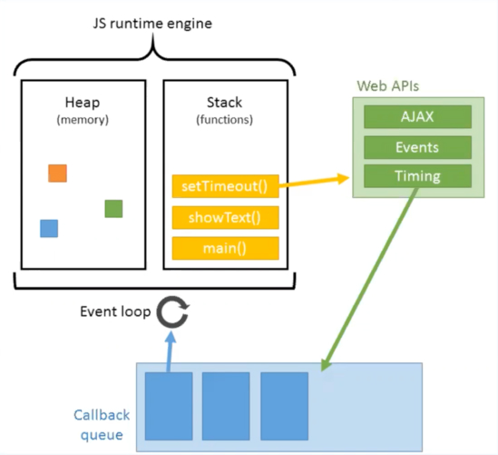

## <mark>JavaScript is a Synchronous language</mark>

JavaScript is a compiled language and is executed by the <mark>V8 engine.</mark>

## V8 Engine

- Developed by Google (comparable to Chakra by Microsoft).
- V8 - A JavaScript Engine for Both Client-Side and Server-Side Execution
- Compiles JavaScript directly into native machine (byte) code before execution.
- Optimizes JavaScript code for improved performance.
- Utilizes caches to enhance execution speed.
- Asynchronous operations are handled by the Event Loop, libuv in Node.js, and web APIs in browsers.

## V8 Engine and Handling Asynchronous Operations

- V8 itself does not directly handle asynchronous operations.
- Instead, it integrates with the Event Loop.
- The <mark>Event Loop</mark> allows JavaScript code to perform non-blocking operations by executing async tasks.
- V8 works alongside the <mark>Libuv</mark> library, which provides support for asynchronous I/O-based operations.
- Input/Output operations are processed between <mark>Node.js and Network/Disk/DB</mark>
- V8 supports modern JavaScript features such as Promises and the async/await syntax.
- It optimizes asynchronous code execution through just-in-time (JIT) compilation and other optimization strategies.

## Libuv library in JavaScript Allows

- Async TCP and UDP sockets
- Async DNS (c-ares IPv6)
- Async filesystem events
- Child processes
- Thread pool

## Event Loop

- The entity that handles external events and converts them into callback invocations.
- A loop that retrieves events from the queue and pushes these callbacks to the call stack.



# Async Function

- Async fun that returns Promise.resolve
- Call this fun will return Promise

```js
const getData = () => {
  const data = {
    username: "Natalia",
    userLastName: "Sabadysh",
    id: 1,
  };

  return Promise.resolve(data);
};

console.log(getData()); // Promise

getData().then((data) => console.log(data));
// data: { username: 'Natalia', userLastName: 'Sabadysh', id: 1 }
```

# ❌ Promise Hell

## We can see the problem when we have multiple requests that rely on each other.

```js
const getUser = () => {
  const data = {
    username: "Natalia",
    userLastName: "Sabadysh",
    id: 1,
  };

  return Promise.resolve(data);
};

const getType = (id) => {
  // .. logic to find the type based on the id
  const data = {
    type: "developer",
    id: 1,
  };

  return Promise.resolve(data);
};
```

### Example with Promise

```js
const getEmployInfo = () => {
  // Promise Hell
  return getUser().then((user) => {
    return getType(user.id).then((typeInfo) => {
      return {
        username: user.username + " " + user.userLastName,
        type: typeInfo.type,
      };
    });
  });
};

getEmployInfo().then((data) => console.log(data));
```

- ❌ Difficult to read
- ❌ Difficult to understand what is happening
- ✅ in this case better to use async/await

### Example with Async/Await

- Execution pauses at the line `await getUser()` until the promise resolves.
- While waiting, Synchronous Code outside of the async function continues to run.
- Once the promise is resolved, execution of the code following `await getUser()` resumes.

```js
const getEmployInfo = async () => {
  try {
    const user = await getUser();
    const typeInfo = await getType(user.id);

    return {
      username: `${user.username} ${user.userLastName}`,
      type: typeInfo.type,
    };
  } catch (error) {
    console.error("Error getting employee information:", error);
  }
};
```

### Example Object methods with Async/Await

```js
const user = {
  async getUser() {},
  async updateUser(updatedData) {},
};

// Example usage:
await user.getUser();
```

- ✅ Using chaining for fetching data offers clearer workflow management.
- ✅ This approach is particularly useful when one response depends on another.

```js
const delay = (ms) => new Promise((resolve) => setTimeout(resolve, ms));

const getUserData = async () => {
  const data = {
    user: "Natalia Sabadysh",
    type: "Developer",
    id: 1,
  };

  await delay(1000); // Simulate delay
  return data;
};

const getOrderData = async (userId) => {
  await delay(1000);
  return {
    orderId: 123,
    userId: userId,
    items: ["item1", "item2"],
  };
};

const fetchUserDataAndOrder = async () => {
  console.time("Start timer"); //Timer label for consistency

  const userData = await getUserData();
  const orderData = await getOrderData(userData.id);

  console.timeEnd("Start timer");

  return { userData, orderData };
};

fetchUserDataAndOrder().then((data) => console.log(data));
```

## Multiple calls

```js
// 1)await/await + Promise.all
// 2)await/await + Promise.race
// 3)await/await + Promise.allSettled -  fulfilled or rejected

const fetchData = async () => {
  try {
    const data = await Promise.all([
      getUserData(),
      getProductData(),
      getOrderData(),
    ]);

    return { userData: data[0], productData: data[1], orderData: data[2] };
  } catch (error) {
    throw error;
  }
};
```

## await/await + Error Handler try catch

```js

// 1- use case
fetchData.then(data=> ).catch(error=>console.log('Error fetching data:')
// 2- use case

const some_func = () => {
    try {
    const data = await fetchData();
    console.log("Fetched data successfully:", data);
  } catch (error) {
    console.error("Error fetching data:", error);
  }
}
```
